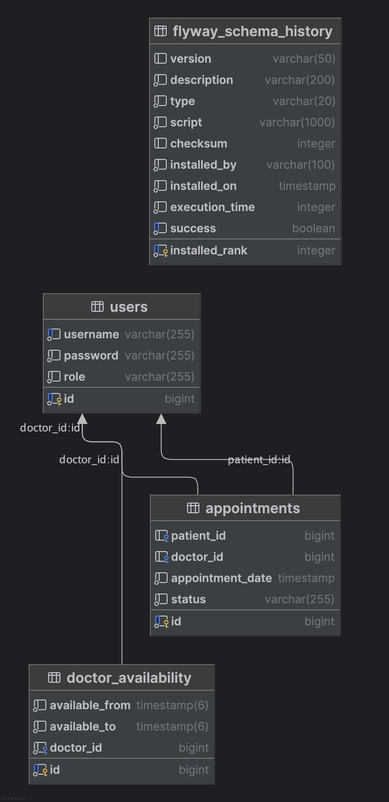
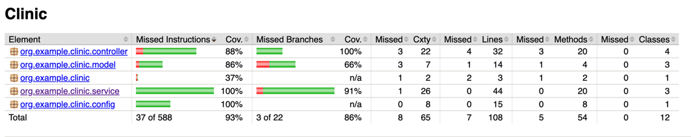
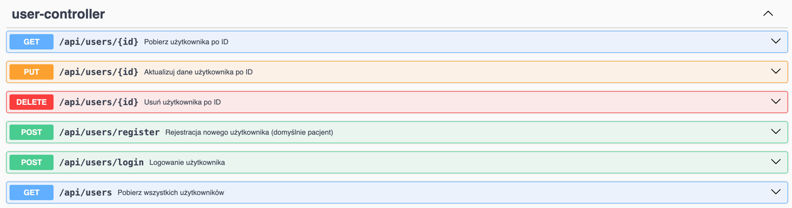
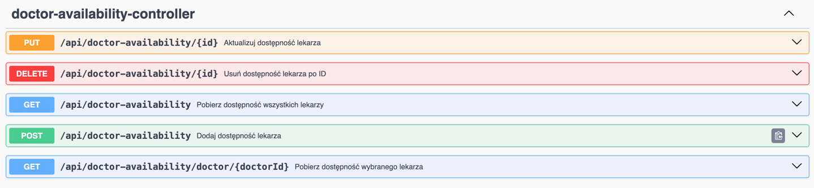
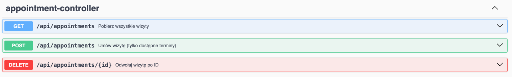

# Clinic App

## Autor
Grzegorz Niedojadło 151913 GK03

## Opis
System rejestracji wizyt pacjentów i zarządzania dostępnością lekarzy.

## Funkce projektowe
- Rejestracja i logowanie pacjentów oraz lekarzy
- Pacjenci mogą umawiać wizyty
- Lekarze mogą zarządzać dostępnością
- Administrator może przeglądać statystyki i historię wizyt

## Technologie
- Java 17, Spring Boot, Spring Security, Spring Data JPA
- Hibernate, PostgreSQL, Flyway
- Docker, Maven
- Springdoc OpenAPI (Swagger UI)
- JUnit, JaCoCo

## Uruchomienie
1. Zbuduj projekt: `./mvnw clean package`
2. Uruchom w Dockerze: `docker-compose up --build`
3. Swagger UI: [http://localhost:8080/swagger-ui.html](http://localhost:8080/swagger-ui.html)

## Struktura projektu

- src/main/java – kod źródłowy aplikacji (kontrolery, serwisy, repozytoria, modele)
- src/main/resources – pliki konfiguracyjne, migracje bazy danych, szablony, statyczne zasoby
- src/test/java – testy jednostkowe i integracyjne
- Dockerfile, docker-compose.yml – pliki do uruchamiania aplikacji w kontenerach
- pom.xml – konfiguracja projektu Maven (zależności, pluginy)
- README.md – dokumentacja projektu

## Struktura bazy danych (ERD)

## Przykładowe migracje (Flyway)
Pliki migracji znajdują się w `src/main/resources/db/migration/`.

## Testy i pokrycie kodu
- Testy jednostkowe: `./mvnw test`

## Screeny API i Swagger UI

## Pokrycie testów

